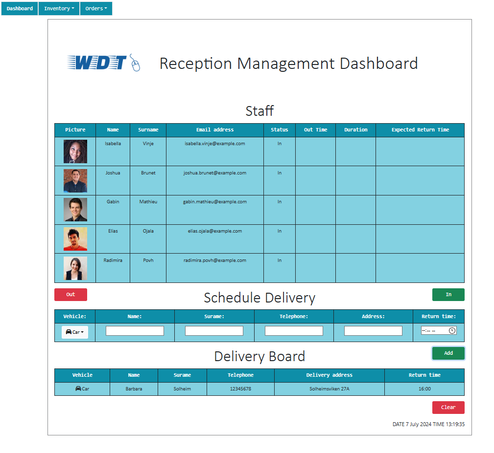

# Course Assignment Information

Grade: A (90-100)

This is the Semester Project I got at the end of my first semester. It was done by me alone. The task was to create a Reception Management Dashboard for a company. We had to fulfill their criteria and utilize Jira to strategize the development of this web application.

The *Initial Commit* is the original code I got for the assignment. This was only a readme and a company logo png file.

The *Final Commit* is my finished code that I sent in for the assignment.

# Screenshot



# Reception Management Dashboard

This is a Reception Management Dashboard to manage staff member out-of-office logging and track deliveries.

## Project Structure

- Documentation/
  - Jira.pdf
- Web Application/
  - Bootstrap.bundle.min.js
  - Company logo.png
  - index.html
  - jquery-3.7.1.js
  - style.css
  - wdt_app.js
- README.md

## Instructions

### How to Use

#### Staff Member Out-of-Office

To log a staff member as out:
- Select a staff member by clicking on them.
- Click the "Out" button.
- Input the amount of time the staff member will be out-of-office in minutes.

To log a staff member as in:
- Select a staff member that's "Out".
- Click the "In" button.

#### Deliveries Tracking

To add a delivery driver:
- Fill in the delivery driver's information in the Schedule Delivery table.
- Click the "Add" button.

To clear a delivery driver:
- Select the delivery driver in the Delivery Board.
- Click the "Clear" button.
- Click "Confirm."

If any of the Staff Members or Delivery Drivers are late, there will be a toast notification notifying this.

## How to Install and Run the Application

1. **Clone the Repository:**
    ```bash
    git clone https://github.com/ArielHalsvik/Semester-Project-Course-Assignment
    ```

2. **Navigate to the Web Application Folder:**
    ```bash
    cd Semester-Project-Course-Assignment/Web Application
    ```

3. **Open the Application:**
    - Find the `index.html` file in the Web Application folder.
    - Open this file in a web browser.

## External libraries

External libraries were used in this project.

**Bootstrap**
- https://getbootstrap.com/

**jQuery**
- https://jquery.com/

**SweetAlert**
- https://sweetalert2.github.io/

**Font Awesome**
- https://fontawesome.com/

## Additional Documentation

Refer to the [Jira.pdf](Documentation/Jira.pdf) for more detailed documentation about the process of creating this Web Application.